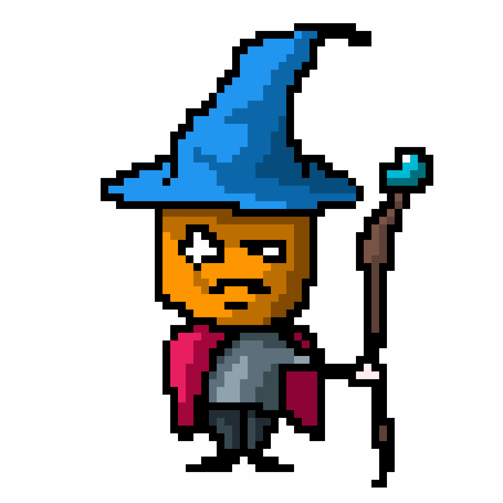

# Hallo ✊

## Little about myself 🧙🏻
Hi, I'm fredrare, but you may know me as Antitesista as well. I am a curious person with thirst for knowledge and challenges.

## Skills, I guess
- [X] Information security
- [X] Fullstack development
- [X] Ethereum development
- [X] Sysadmin
- [ ] Graphics programming
- [ ] Blender

## My links 🔗
- [Personal page](https://fredrare.com)
- [Codewars](https://www.codewars.com/users/fredrare)
- [Codingame](https://www.codingame.com/profile/5de7afa953f69462f305ec1e809358a98171624)
- [Discord server](https://discord.gg/tJa66GNhej)

## Badges 🍚
### Codewars profile

### Github stats

### Wakatime lang stats

I use Arch, btw
